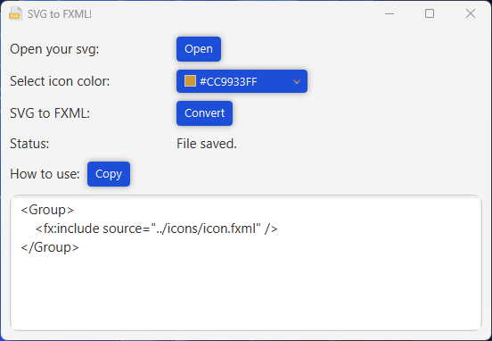

# 🌟 SVG to FXML Converter 🌟

A user-friendly JavaFX application that transforms SVG files into FXML format with ease.  
This tool is designed to streamline the integration of SVG graphics into JavaFX projects,  
converting SVG paths into FXML-compatible syntax effortlessly. 🎨🖌️📄

---

## ✨ Features ✨

- **Convert SVG paths to FXML** using an intuitive and user-friendly interface.
- **Customize colors** with an integrated color picker for dynamic design.
- **Step-by-step guidance** provided in the text area to help you implement the icon seamlessly into your JavaFX project.

---

## ⚙️ Requirements ⚙️

- **Java 21.0.5 or later**
- **JavaFX 21.0.5 libraries** (included in the JAR files)

---

## 🛠️ How to Use 🛠️

1. Launch the application by running the JAR file specific to your operating system.
2. Click the "Open" button to select an SVG file from your device.
3. Optionally, adjust colors using the built-in color picker.
4. Click the "Convert" button to generate the FXML code.
5. Follow the implementation guidance displayed in the text area to integrate the generated icon into your project.

---

## 📥 [Download Links](https://github.com/alvaromg-dev/SVG-to-FXML-Converter/releases/) 📥

---

## 📸 Screenshot 📸

---

## 📜 [License](LICENSE) 📜

- This project is licensed under the MIT License. Feel free to use, modify, and distribute it under the terms of the license.
- Icons sourced from [SVGRepo](https://www.svgrepo.com) under the CC0 license.

---

Start integrating your SVG designs into JavaFX effortlessly with the SVG to FXML Converter! 🚀
